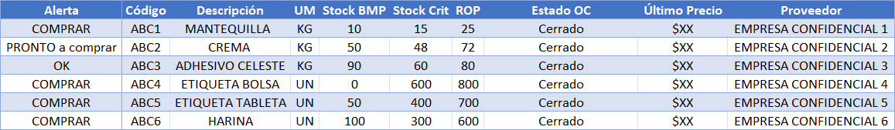
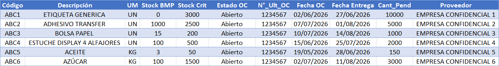

# Sistema Automatizado de Alertas de Inventario E2E

Sistema automatizado de ingeniería de datos (ETL y distribución) desarrollado con **Power Platform (Power BI, Power Automate)** y **TypeScript**, integrado con **SAP HANA**, que gestiona la detección proactiva de quiebres de stock y el seguimiento de órdenes de compra.

El sistema automatiza el ciclo completo: desde el cálculo de lógicas de abastecimiento en el modelo semántico hasta la distribución de reportes accionables, reduciendo la extracción y consolidación manual de 0 a 100%, eliminando el error humano en la interpretación de planillas.

> **Nota:** este repositorio contiene únicamente los scripts de procesamiento (TypeScript), las consultas de base de datos (DAX) y el orquestador del flujo. El archivo Excel operativo, los correos y todos los datos transaccionales reales se excluyen deliberadamente por confidencialidad.

---

## El problema de negocio

El equipo de abastecimiento requiere visibilidad diaria sobre los SKU de "Línea" críticos (Stock < ROP) y aquellos con Órdenes de Compra pendientes. El control manual generaba tres riesgos concretos:

- **Quiebres de stock por latencia de datos**: el tiempo invertido en cruzar el reporte del ERP con los ajustes manuales de bodega retrasaba la decisión de compra.
- **Falsos quiebres por lógicas de sistema**: SAP HANA refleja movimientos de traslado a talleres externos que operativamente equivalen a consumo real, lo que descuadraba el stock proyectado si no se analizaba correctamente.
- **Formateo manual ineficiente**: la exportación de reportes, el formateo de tablas y la corrección de fechas consumía tiempo valioso al inicio de cada jornada laboral.

El sistema resuelve esto imponiendo una arquitectura de extracción directa (API REST), unificando las reglas de negocio del ERP con parámetros dinámicos gestionados por el negocio, y orquestando la entrega del dato limpio directamente en la bandeja de entrada del comprador.

---

## Decisiones técnicas destacadas

Este proyecto no es una simple exportación programada. Implementa patrones propios de ingeniería de datos y *Headless BI*:

### Modelo semántico híbrido (ERP + Políticas de Stock Dinámicas)
El motor de Power BI no se usa solo para visualización, sino como un motor de unificación de reglas de negocio cruzando dos entornos:
1. **Datos Transaccionales (Rígidos):** Se extraen desde SAP HANA todos los movimientos y niveles de stock actualizados.
2. **Políticas de Stock (Flexibles):** Se conectan desde un archivo Excel alojado en la nube (SharePoint). 

**La justificación técnica:** Se decidió mantener las políticas de abastecimiento (Stock Mínimo, Punto de Reorden, Lead Time) fuera del código rígido del ERP debido a la poca flexibilidad del ERP, la inmensa cantidad de SKUs, su alta variabilidad de consumo y la fuerte estacionalidad. Al mantener esta matriz en la nube, el equipo de compras puede ajustar ágilmente los parámetros operativos de sus productos, y Power BI recalcula automáticamente las alertas en la siguiente iteración sin depender de soporte TI.

### Arquitectura On-Premises to Cloud (Data Gateway)
Dado que la base de datos de SAP HANA se encuentra alojada en un servidor remoto seguro sin exposición directa a internet, no existe una conexión directa desde la nube. Para resolver esto, el sistema utiliza un **Power BI On-premises Data Gateway**, estableciendo un túnel seguro y encriptado que permite al modelo semántico actualizar los datos transaccionales diariamente sin comprometer los firewalls de la infraestructura corporativa.

### Extracción "Headless BI" (DAX vía API)
En lugar de exportar un reporte visual completo, el flujo envía una consulta transaccional pura (`SUMMARIZECOLUMNS`) a la API de Power BI. Esto permite procesar la respuesta en formato JSON ligero en milisegundos, obteniendo únicamente los SKU que requieren acción (filtros estrictos de no-obsolescencia, estados de OC y umbrales de ROP).

### Transformación y parseo de localización
Al procesar los datos JSON en la nube mediante TypeScript, el servidor de Microsoft inyecta por defecto marcas de tiempo en formato estadounidense (`MM/DD/YYYY`). El script intercepta estas cadenas, las fragmenta y las invierte dinámicamente al formato local (`DD/MM/YYYY`) antes de escribirlas en el DOM de Excel, evitando el riesgo de lectura errónea de fechas críticas.

### Lógica de consumo real e inferencia de bodegas
La consulta base excluye proactivamente los inventarios de producción pura y bodegas de producto terminado, aislando únicamente las ubicaciones tipificadas como tiendas. Además, clasifica los movimientos de "Productos en proceso" con el tipo de movimiento de salida correcto para evitar descuadres sistémicos.

---

## Arquitectura del código

| Componente | Responsabilidad |
|---|---|
| `src/Consulta_API.dax` | Extracción de la alerta neta vía API, con cruce de filtros (`TREATAS`) y cálculos DAX optimizados. |
| `src/Formato_Reporte.ts` | ETL en la nube (Office Scripts). Purga de datos históricos, mapeo de matriz JSON y transformación de tipos y fechas. |
| `export/Flujo_Inventario.zip` | Orquestador lógico (Power Automate). Gestiona el Trigger, llamadas HTTP, ejecución de scripts y despacho SMTP. |

La documentación visual y los diagramas de arquitectura se encuentran en la carpeta [`docs/`](docs/):

 — diagrama del flujo de datos desde SAP HANA hasta Outlook.

### Visualización del Entregable (Datos Simulados)

**1. Pestaña de Alertas de Compra:**

**2. Pestaña de Seguimiento de OC en tránsito:**

---

## Flujo operativo

1. El orquestador (cron) se dispara de Lunes a Viernes a las 08:30 AM.
2. Power Automate envía el `Consulta_API.dax` al modelo semántico para cruzar los datos transaccionales de SAP HANA con la matriz de Políticas de Stock alojada en Excel.
3. Se recibe el JSON con los SKU críticos y se pasa como argumento al entorno de SharePoint.
4. El script `Formato_Reporte.ts` limpia la plantilla, inyecta la nueva data, corrige fechas y autoajusta el DOM.
5. El flujo captura el rango dinámico de la tabla y lo incrusta en un correo HTML estructurado para el equipo de compras.

---

## Stack técnico

- **SQL** — Consultas estructuradas para la creación de vistas y extracción optimizada de datos transaccionales.
- **Power BI On-premises Data Gateway** — Puente de red seguro entre el servidor remoto y la nube.
- **Power BI / DAX** — Modelado semántico y Headless BI (API REST).
- **SAP HANA** — ERP origen de movimientos operativos y maestros de materiales.
- **Power Automate** — Orquestación de servicios en la nube.
- **TypeScript (Office Scripts)** — Manipulación del DOM en Excel Web y parseo de datos JSON.
- **Metodología ETL** — Extracción, Transformación y Carga automatizada.

---

## Sobre el alcance

El sistema actual resuelve la urgencia operativa de visibilidad (Fase 1). La arquitectura de datos híbrida ya implementada sienta las bases de la Fase 2: la creación de una Power App donde los compradores podrán visualizar esta misma lista y "asignarse" SKUs críticos, escribiendo el estado de la gestión directamente sobre el modelo semántico. A futuro (Fase 3), esta misma base de datos estructurada será el repositorio de conocimiento para un agente interactivo (Copilot) construido sobre Azure AI.
